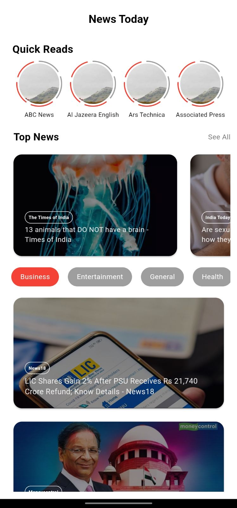
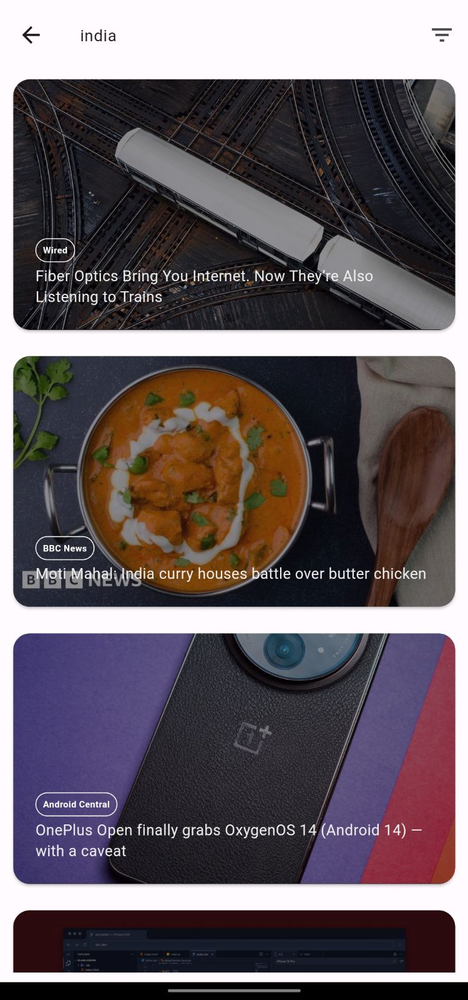
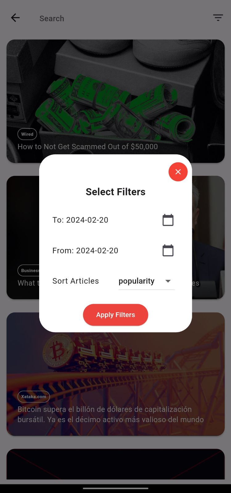

# news_app

A new Flutter project.

## Getting Started

This project is a starting point for a Flutter application.

A few resources to get you started if this is your first Flutter project:

- [Lab: Write your first Flutter app](https://docs.flutter.dev/get-started/codelab)
- [Cookbook: Useful Flutter samples](https://docs.flutter.dev/cookbook)

For help getting started with Flutter development, view the
[online documentation](https://docs.flutter.dev/), which offers tutorials,
samples, guidance on mobile development, and a full API reference.

✍🏻 **Intro**:

Introducing our News app, designed for efficient and swift updates. With Quick Reads, you can swiftly glance through news titles and catch up on top headlines, ensuring you're always informed on-the-go. This app offers categorized sections, allowing you to delve into specific topics of interest effortlessly. Plus, with a powerful search feature, finding relevant articles is a breeze. Stay informed and ahead of the curve with our News app.


📚 **TechStack**:

Our News app is built using the **Flutter framework**, ensuring a smooth and consistent user experience across multiple platforms.

To fetch news data, we integrate the newsapi.org API, allowing us to access a vast repository of news articles from various sources and categories.

Here's a breakdown of the key packages we utilize:

1. **http**: We use the HTTP package to make network requests and fetch data from the API.

2. **flutter_riverpod**: This package facilitates state management in our app, enabling us to manage and share data across different parts of the application efficiently.

3. **cached_network_image**: To enhance performance and optimize image loading, we utilize the cached_network_image package, which provides caching capabilities for network images.

4. **shimmer**: Shimmer effect adds a subtle loading animation to our UI elements, providing a smooth transition while content is being loaded.

5. **stories_for_flutter**: This package allows us to implement stories functionality, enabling users to view news stories in a visually engaging format.

6. **webview_flutter**: We integrate webview_flutter to display web content within our app, ensuring users can access full articles or external content seamlessly.

7. **url_launcher**: With url_launcher, we can launch external URLs, directing users to external sources for further information or interaction.

8. **share_plus**: This package enables users to share news articles with others via various platforms and communication channels.

9. **story_view**: Another package for implementing story views, enhancing the user experience with interactive and visually appealing news stories.

10. **status_view**: This package provides utilities for displaying status messages or alerts to users, enhancing communication and feedback within the app.

11. **intl**: For internationalization and localization support, we use the intl package to ensure our app can reach a global audience with localized content.

12. **connectivity_plus**: Lastly, the connectivity_plus package helps us monitor and manage network connectivity, ensuring a seamless experience even in varying network conditions.


👨🏻‍🍳 **features**:

Here's a breakdown of the features of the News app:

1. **Quick Reads**:
   - Users can quickly browse news headlines from different channels.
   - Each news channel displays a status with a different story, allowing users to catch up on various news topics efficiently.

2. **Top News Headlines**:
   - Access top news headlines directly within the app.
   - View news articles using a built-in web view for seamless reading.
   - Share interesting news articles with others via a share button, enabling easy sharing across various platforms and communication channels.

3. **Category-Based News**:
   - News is categorized into various sections such as Business, Entertainment, General, Health, Science, Sports, and Technology.
   - Users can browse news articles based on their preferred categories.
   - Articles can be viewed within the app and shared with others.

4. **Search Functionality**:
   - Search for news articles from around the world using a search feature.
   - Users can input keywords or phrases to find specific news topics of interest.

5. **Advanced Filters**:
   - Advanced filtering options allow users to refine their news search.
   - Set date ranges to specify the period for which news articles are displayed.
   - Sort news articles based on popularity or recency.
   - Apply filters to display relevant news articles based on user preferences.

6. **Internet Connectivity Status**:
   - The app detects and handles internet connectivity status.
   - When there is no internet connection, a Snackbar message notifies the user about the lack of connectivity.
   - Upon reconnecting to the internet, another Snackbar message confirms the internet connection, ensuring users are aware that data can be fetched and displayed.


💭 **Process**:

The development process of the News app involves following the MVC (Model-View-Controller) architecture and utilizing Riverpod for state management. Here's an overview of the key steps involved:

1. **Models**:
   - Structuring the data models to represent the data fetched from the News API. These models typically include classes to parse and represent news articles, categories, and other relevant information.

2. **Controllers**:
   - Implementing controllers responsible for fetching data from the News API.
   - Utilizing HTTP requests and streams to fetch real-time data from the API.
   - Parsing the JSON response using the structured data models.
   - Organizing and managing data using controllers, which may involve creating lists of articles, categorizing news, etc.

3. **Providers**:
   - Using Riverpod to manage state in the application.
   - Creating provider instances for controllers using the `Provider` or `StreamProvider` to provide a stream of values.
   - Using `ref.watch` to access and retrieve data from the provider instances within the application.
   - Setting up provider scopes to ensure proper dependency injection and state management throughout the app.

4. **Main.dart**:
   - Wrapping the `runApp` function with a `ProviderScope` to establish the Riverpod provider hierarchy and enable state management within the app.
   - Initializing and configuring providers within the provider scope to make them accessible across the entire application.

5. **Views**:
   - Implementing UI components using Flutter widgets to display data fetched from providers.
   - Utilizing `Consumer` widgets to read and watch provider values and update the UI accordingly.
   - Breaking down UI code into components for better organization and reusability.
   - Displaying news articles, headlines, categories, and other information on various UI parts based on the data fetched and managed by the controllers and providers.

By following the MVC architecture and integrating Riverpod for state management, the News app achieves a structured and efficient development process. 


🚦 **Running the Project**

1. **Clone the repository**:
    ```bash
    git clone https://github.com/your-username/your-repo.git
    ```

2. **Navigate to the Flutter project directory**:
    ```bash
    cd your-repo/flutter_app
    ```

3. **Install dependencies**:
    ```bash
    flutter pub get
    ```

4. **Run the application**:
    ```bash
    flutter run
    ```

The application should now be running on the connected emulator or physical device.


📷 **Screenshots**:





